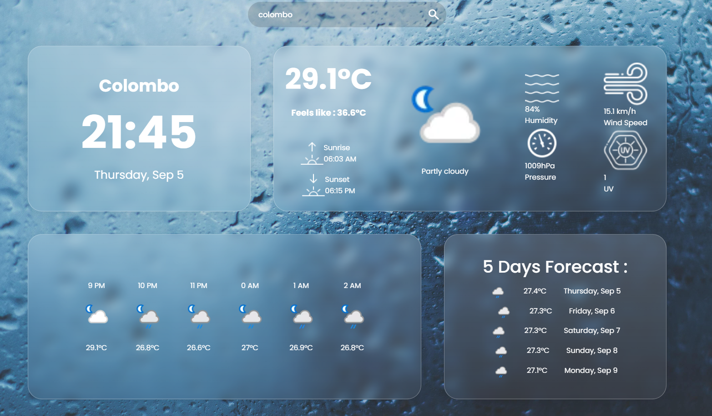
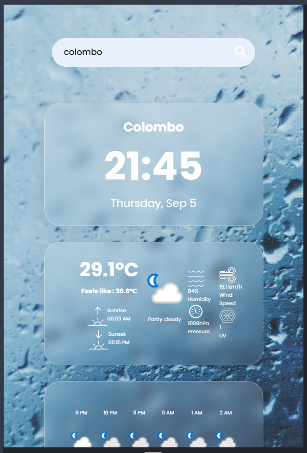

# Weather App 🌦️

## Introduction

Welcome to the **Weather App**! This web application provides real-time weather information for any location in the world. It is built using HTML, CSS, and JavaScript, and it fetches data from a reliable Weather API to display current weather conditions, temperature, humidity, and more.

## Features

-   🌍 **Global Search:** Search for the weather in any city across the globe.
-   📊 **Real-Time Data:** Get up-to-date weather information.
-   🌡️ **Temperature Display:** See the current temperature in both Celsius and Fahrenheit.
-   💧 **Humidity Levels:** Know the current humidity of the selected location.
-   🎨 **Responsive Design:** The app is fully responsive and works on all devices.

## Preview

### Desktop View

### Mobile View

## Technologies Used

-   **HTML5**: For the structure of the web pages.
-   **CSS3**: For styling and layout.
-   **JavaScript (ES6+)**: For fetching data from the API and updating the UI dynamically.
-   **Weather API**: Used to retrieve weather data.

## Setup and Installation

1. Ensure you have a modern web browser installed (Chrome, Firefox, Edge).
2. No additional dependencies are required—just open the `index.html` file in your preferred browser.
3. (Optional) If you want to modify or enhance the app, you'll need a text editor like Visual Studio Code.

## Acknowledgments

-   Thanks to the creators of the Weather API for providing reliable weather data.

---

_🐳._
